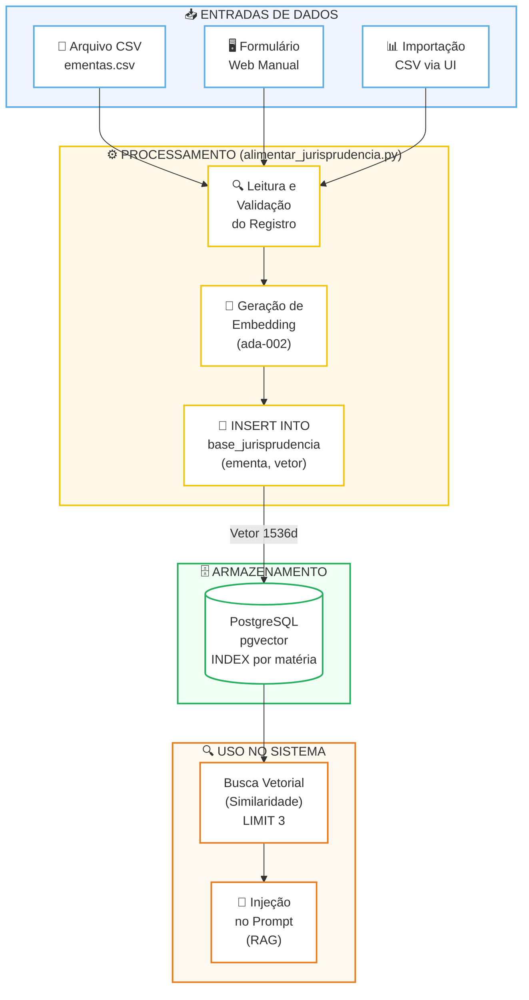
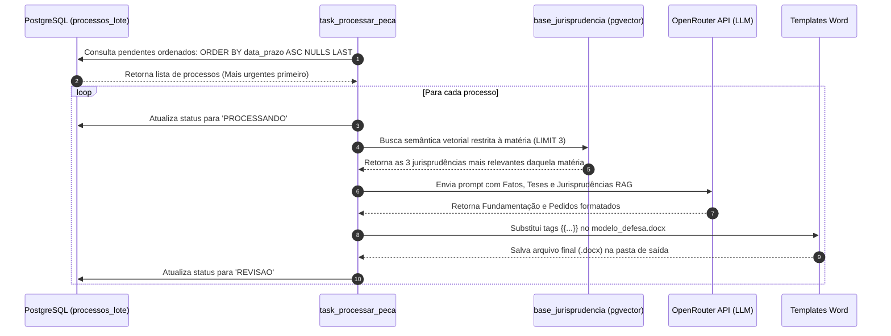
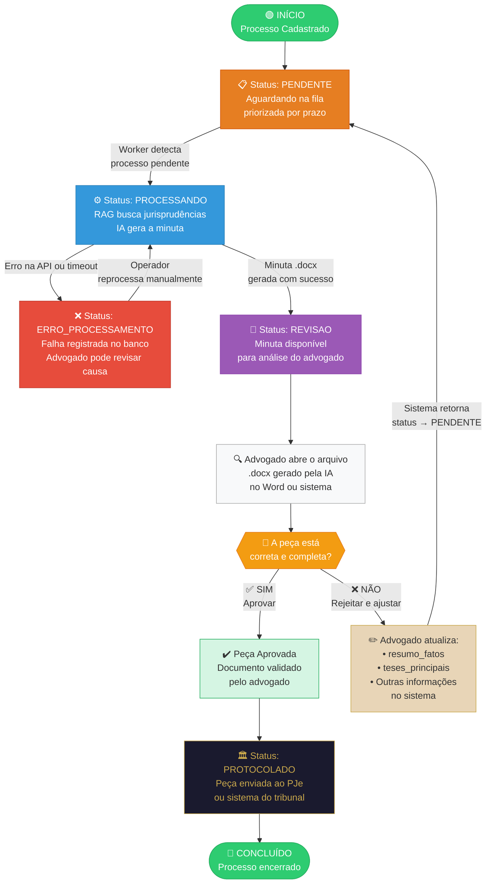
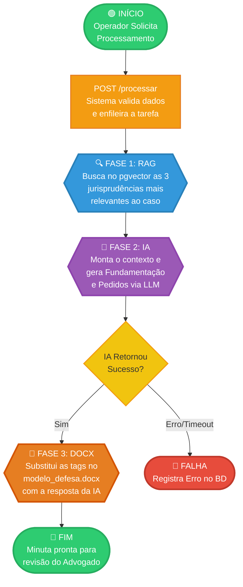
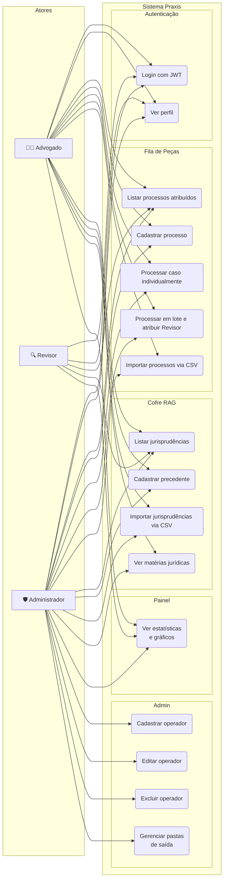
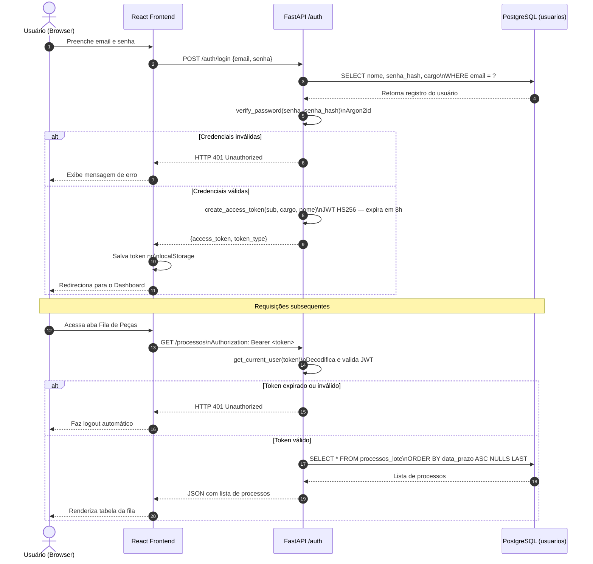
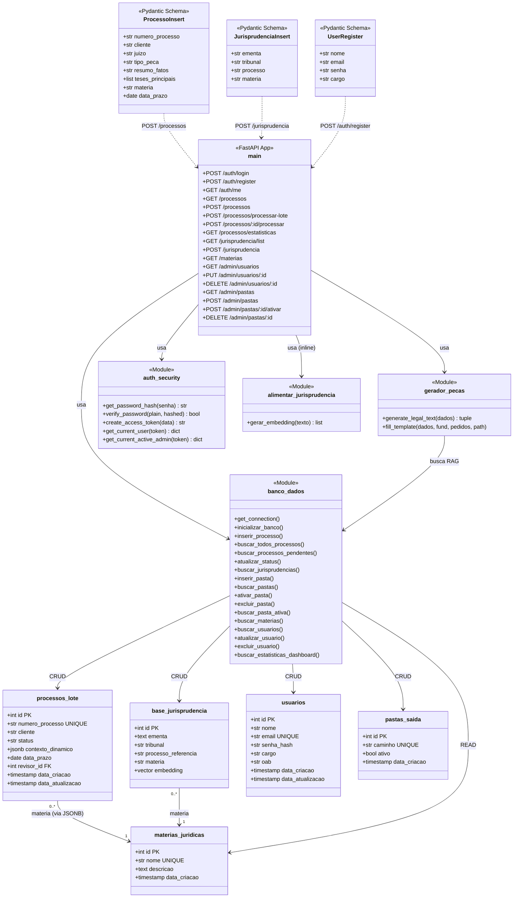

# Fluxos e Diagramas UML — Praxis Automação Jurídica

Este documento serve como referência técnica completa para o funcionamento, arquitetura e fluxos de dados do sistema **Praxis**.

---

## 🏛️ 1. Arquitetura Geral do Ecossistema

O ecossistema é composto por interfaces web (React e Angular), uma API FastAPI, um banco de dados relacional/vetorial PostgreSQL e workers assíncronos. Ambos os frontends se comunicam com o mesmo backend em Python.

```mermaid
graph TD
    subgraph FRONTEND_REACT ["🖥️  FRONTEND REACT — React / Vite (localhost:5173)"]
        UI_Login["🔐 Tela de Login\nJWT / Argon2id"]
        UI_Dash["📊 Painel de Estatísticas\nGráficos SVG em tempo real"]
        UI_Fila["⚖️  Fila de Casos\nOrdenada por Prazo"]
        UI_RAG["📚 Cofre RAG\nPrecedentes Vetorizados"]
        UI_Admin["⚙️  Admin\nGestão de Operadores"]
    end

    subgraph FRONTEND_ANGULAR ["🖥️  FRONTEND ANGULAR — Angular v20 (localhost:4200)"]
        UI_Login_A["🔐 Tela de Login\nJWT / Signals"]
        UI_Dash_A["📊 Painel de Estatísticas\nGráficos SVG em tempo real"]
        UI_Fila_A["⚖️  Fila de Casos\nOrdenada por Prazo"]
        UI_RAG_A["📚 Cofre RAG\nPrecedentes Vetorizados"]
        UI_Admin_A["⚙️  Admin\nGestão de Operadores"]
    end

    subgraph BACKEND ["⚡ BACKEND — FastAPI / Python (localhost:8087 / 8000)"]
        AUTH["🔑 Auth Module\nJWT + Argon2id"]
        API_PROC["📋 /processos\nCRUD + Fila"]
        API_JUR["📖 /jurisprudencia\nRAG Embeddings"]
        API_ADMIN["🛡️  /admin\nUsuários + Pastas"]
        WORKER["🔄 BackgroundTask\ntask_processar_peca"]
    end

    subgraph DATABASE ["🗄️  PostgreSQL + pgvector"]
        DB_PROC[("processos_lote\nJSONB + Prazo")]
        DB_JUR[("base_jurisprudencia\nvector 1536 dims")]
        DB_USR[("usuarios\nArgon2id hash")]
        DB_PASTA[("pastas_saida\nCaminho de saída")]
    end

    subgraph EXTERNAL ["☁️  APIs Externas"]
        LLM["🤖 OpenRouter\ngpt-4o / LLM"]
        EMB["🔢 OpenRouter\ntext-embedding-ada-002"]
    end

    UI_Login -->|"POST /auth/login"| AUTH
    UI_Dash -->|"GET /processos/estatisticas"| API_PROC
    UI_Fila -->|"GET/POST /processos"| API_PROC
    UI_RAG -->|"GET/POST /jurisprudencia"| API_JUR
    UI_Admin -->|"CRUD /admin"| API_ADMIN

    UI_Login_A -->|"POST /auth/login"| AUTH
    UI_Dash_A -->|"GET /processos/estatisticas"| API_PROC
    UI_Fila_A -->|"GET/POST /processos"| API_PROC
    UI_RAG_A -->|"GET/POST /jurisprudencia"| API_JUR
    UI_Admin_A -->|"CRUD /admin"| API_ADMIN

    AUTH --> DB_USR
    API_PROC --> DB_PROC
    API_PROC -->|"Dispara"| WORKER
    API_JUR --> DB_JUR
    API_ADMIN --> DB_USR
    API_ADMIN --> DB_PASTA

    WORKER -->|"Busca semântica pgvector"| DB_JUR
    WORKER -->|"Atualiza status"| DB_PROC
    WORKER -->|"Gera texto jurídico"| LLM
    API_JUR -->|"Gera embeddings"| EMB

    WORKER -->|"Salva .docx"| SAIDA["📁 Pasta de Saída\n.docx por cliente"]
```



---

<div style="page-break-before: always;"></div>

## 🗂️ 2. Fluxo A: Gestão e Alimentação de Jurisprudência (RAG)

A base de dados de precedentes jurídicos é alimentada de forma isolada, permitindo inclusões e atualizações constantes sem pausar a geração de peças.



### Funcionamento:
- **Entrada:** CSV contendo `ementa;tribunal;processo;materia`.
- **Segmentação:** A coluna `materia` categoriza o precedente (ex: "Direito Bancário", "Trabalhista") para que a busca vetorial futura filtre apenas julgados pertinentes ao caso.
- **Inserção:** O script de alimentação gera o vetor de 1536 dimensões e insere tudo no banco PostgreSQL (`base_jurisprudencia`).

---

## ⏳ 3. Fluxo B: Fila de Geração Priorizada por Prazos

O processamento das peças respeita os prazos fatais (`data_prazo`). A fila consome os registros priorizando os prazos mais urgentes e próximos.



### Regra de Ordenação SQL:
```sql
SELECT * 
FROM processos_lote 
WHERE status = 'PENDENTE' 
ORDER BY data_prazo ASC NULLS LAST;
```
- **`data_prazo ASC`**: Prioriza datas mais antigas/próximas de vencer.
- **`NULLS LAST`**: Joga processos sem data cadastrada para o fim da fila.

---

## 🔁 4. Fluxo C: Ciclo de Revisão e Aprovação de Peças (Human-in-the-Loop)

Para garantir a qualidade técnica das peças geradas antes do protocolo judicial, as minutas passam por uma etapa de revisão pelo advogado. Caso a peça necessite de correções, ela retorna para a fila de processamento até ser aprovada.



### Regras do Ciclo de Correção e Versionamento:
1. **Edição Direta vs. Reprocessamento:** 
   - Se os ajustes forem de **formatação ou pequenas correções**, o advogado edita o arquivo `.docx` diretamente no Word, salva e marca como "Aprovado" no sistema. O sistema utilizará este arquivo editado para o protocolo.
   - Se a peça estiver **incompleta ou com teses erradas**, o advogado altera as instruções (ex: altera `resumo_fatos`, adiciona `teses_principais` ou preenche um campo de "Feedback para a IA") na interface do sistema e clica em **Reprovar/Reprocessar**.
2. **Reinserção Automática:** Ao clicar em reprovar, o status do processo no banco de dados retorna para `'PENDENTE'`. O documento `.docx` anterior é descartado ou arquivado como versão antiga (ex: `minuta_v1.docx`).
3. **Nova Geração (Re-processamento):** O Worker detecta o status `'PENDENTE'`, lê o contexto atualizado (agora contendo o feedback do advogado) e gera uma **nova minuta do zero** (`minuta_v2.docx`), re-alimentando o status para `'REVISAO'`. Isso garante que a IA corrija os fundamentos jurídicos de forma estrutural sem que o advogado precise reescrever o texto manualmente.
---

## 📊 5. Diagrama de Atividade — Geração de Minuta Jurídica

Descreve o fluxo de atividades passo a passo desde a requisição até a entrega do documento.



---

## 👥 6. Diagrama de Caso de Uso — Atores e Funcionalidades

Mapeia o que cada perfil de usuário pode fazer no sistema.



---

## 🔄 7. Diagrama de Sequência — Autenticação e Acesso à API

Fluxo detalhado de login e uso seguro dos endpoints com JWT.



---

## 🗄️ 8. Diagrama de Classes — Modelo de Dados e Módulos

Representa as entidades do banco de dados, os schemas Pydantic da API e as relações entre os módulos Python.



---

## 📋 Resumo dos Status do Processo

| Status | Descrição | Transição |
|---|---|---|
| `PENDENTE` | Aguardando processamento na fila | → `PROCESSANDO` |
| `PROCESSANDO` | Worker gerando a minuta com IA+RAG | → `REVISAO` ou `ERRO_PROCESSAMENTO` |
| `REVISAO` | Minuta gerada, aguardando aprovação do advogado | → `PROTOCOLADO` ou volta para `PENDENTE` |
| `PROTOCOLADO` | Peça aprovada e enviada ao PJe | — (estado final) |
| `ERRO_PROCESSAMENTO` | Falha na geração (timeout, erro de API, etc.) | → `PENDENTE` (reprocessar) |
