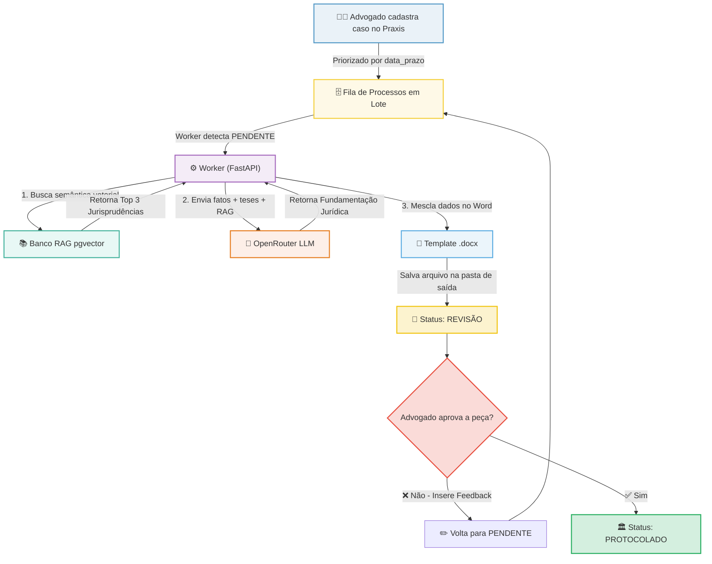

# ⚖️ Praxis — Automação Jurídica

Plataforma inteligente de automação de defesas e peças jurídicas utilizando Inteligência Artificial, busca vetorial baseada em **RAG (Retrieval-Augmented Generation)** e **PostgreSQL com pgvector**.

O **Praxis** foi projetado para otimizar o fluxo de trabalho de escritórios de advocacia, organizando processos por urgência de prazos, gerando minutas de alta fidelidade técnica em formato Word (`.docx`) a partir de modelos pré-definidos e inserindo jurisprudências relevantes de forma automatizada.

---

## 🚀 Principais Benefícios para o Escritório

A **Praxis** foi desenhada especificamente para resolver os gargalos produtivos mais comuns em escritórios de advocacia de médio e grande volume:

1. **⚡ Geração de Peças em Escala (Lote)**: Permite o upload de uma planilha CSV com dezenas de casos pendentes. A IA atua em segundo plano, gerando todas as minutas ao mesmo tempo e eliminando o processo de redigir peças semelhantes uma a uma.
2. **🎯 Fim das "Alucinações" de IA (Cofre RAG)**: Ao invés de depender de respostas genéricas do ChatGPT que podem inventar leis, a ferramenta constrói um cofre de conhecimento com as jurisprudências reais do seu escritório. A IA "lê" o caso e busca no cofre o precedente exato, garantindo segurança técnica.
3. **🛡️ Governança e Revisão Controlada**: Separação clara de papéis (Administrador, Revisor, Advogado). Os documentos gerados pela máquina não vão direto para o cliente; eles caem em uma fila de revisão onde o revisor (com sua OAB registrada e vinculada) pode editar, regerar ou aprovar o conteúdo.
4. **📄 Documentos Prontos para Uso (`.docx`)**: A aprovação gera instantaneamente um arquivo Microsoft Word (`.docx`) já no formato ideal (texto justificado, margens e cabeçalhos corretos), pronto para protocolo no PJe ou Eproc sem precisar de formatação extra.
5. **📊 Gestão Visual de Prazos**: O painel categoriza processos por urgência e status (Pendente, Erro, Revisão, Protocolado), permitindo aos gestores acompanhar o fluxo e garantir que nenhuma data crítica seja perdida.

---

## 🛠️ Tecnologias e Linguagens Utilizadas

O sistema é construído sobre uma arquitetura moderna e dividida em camadas:

| Componente | Tecnologias Utilizadas | Propósito |
| :--- | :--- | :--- |
| **Frontend** | React, Vite, JavaScript, TailwindCSS | Interface do usuário rápida, responsiva e com gráficos em tempo real |
| **Backend** | Python, FastAPI, Uvicorn, Streamlit | API de alto desempenho, workers assíncronos e scripts de automação |
| **Banco de Dados** | PostgreSQL + `pgvector` | Armazenamento de dados relacionais e busca semântica vetorial (1536 dimensões) |
| **Autenticação** | JWT (JSON Web Tokens) + Argon2id | Autenticação segura de usuários com controle de permissões por cargo |
| **IA / LLM** | OpenRouter (GPT-4o, text-embedding-ada-002) | Geração do texto das peças jurídicas e criação de vetores de embeddings |
| **Documentação** | Python `python-docx` | Geração final de minutas editáveis no padrão Microsoft Word |

---

## 🏗️ Fluxo Resumido da Operação

O ecossistema opera unindo a automação assíncrona baseada em IA e a supervisão humana (*Human-in-the-Loop*). Abaixo está o fluxo simplificado do processamento de uma peça jurídica:



---

## 📂 Estrutura do Repositório

```plaintext
├── .agents/                 # Configurações de IA e assistentes
├── backend/                 # API FastAPI, Banco de Dados, scripts Python
│   ├── alimentar_jurisprudencia.py  # Script para vetorização de julgados
│   ├── auth_security.py             # Lógica de login, hashes e JWT
│   ├── banco_dados.py               # Queries SQL e conexões com o PostgreSQL
│   ├── gerador_pecas.py             # Integração com a LLM e preenchimento de DOCX
│   └── main.py                      # Arquivo principal da API FastAPI
├── frontend/                # Interface web em React
│   ├── src/                         # Componentes, rotas e views da aplicação
│   ├── vite.config.js               # Configuração do bundler Vite
│   └── package.json                 # Dependências Node.js
├── FLUXOS.md                # Documentação técnica e diagramas UML detalhados
├── docker-compose.yml       # Orquestrador local para subir o PostgreSQL + pgvector
└── README.md                # Esta visualização geral do projeto
```

---

## 🚀 Como Executar o Projeto (Produção e Desenvolvimento com Docker)

O ambiente foi totalmente otimizado para rodar via Docker, garantindo que o Backend e o Frontend funcionem com imagens leves e seguras em qualquer sistema operacional ou servidor.

### 1. Pré-requisitos
* **Docker e Docker Compose** instalados.

### 2. Configurando as Variáveis de Ambiente
Na **raiz do projeto** (na mesma pasta do `docker-compose.yml`), crie um arquivo chamado `.env` e configure as seguintes variáveis:

```ini
# Chaves de API das Inteligências Artificiais
GEMINI_API_KEY=sua-chave-aqui
OPENROUTER_API_KEY=sua-chave-aqui

# Conexão com o seu banco Postgres existente
DB_HOST=192.168.1.107  # Coloque o IP do seu servidor de banco de dados
DB_PORT=5432
DB_NAME=seu_banco
DB_USER=seu_usuario
DB_PASS=sua_senha

# Chaves de Segurança da Autenticação (JWT e Senhas)
JWT_SECRET=coloque-uma-senha-gigante-e-secreta-aqui
PASSWORD_PEPPER=outra-senha-gigante-aleatoria-diferente-da-primeira
```

### 3. Construindo e Executando os Containers
Execute a sequência de comandos abaixo. A flag `--no-cache` garante que o Docker leia as dependências e chaves mais recentes:

```bash
sudo docker compose down
sudo docker compose build --no-cache
sudo docker compose up -d
```

### 4. Acessando a Plataforma
Após os containers subirem com sucesso:
* **Interface Web (Frontend):** Acesse `http://IP_DA_VM:5173` (ou `localhost:5173`).
* **API e Swagger (Backend):** Acesse `http://IP_DA_VM:8087/docs` (ou `localhost:8087/docs`).

> **📁 Arquivos Gerados:** Os documentos `.docx` das peças jurídicas e revisões serão salvos automaticamente e espelhados na pasta `./documentos_gerados` na raiz do seu projeto, graças ao volume compartilhado do Docker!

---

## 👥 Atores do Sistema
O sistema suporta três perfis de acesso distintos configurados via banco de dados:
* **Administrador**: Controle total, gestão de usuários, definição de pastas de saída e reprocessamento.
* **Advogado**: Criação de casos, importação de CSVs, alimentação da base de dados RAG e aprovação final das peças.
* **Revisor**: Leitura dos casos cadastrados, visualização de estatísticas e controle das jurisprudências.
