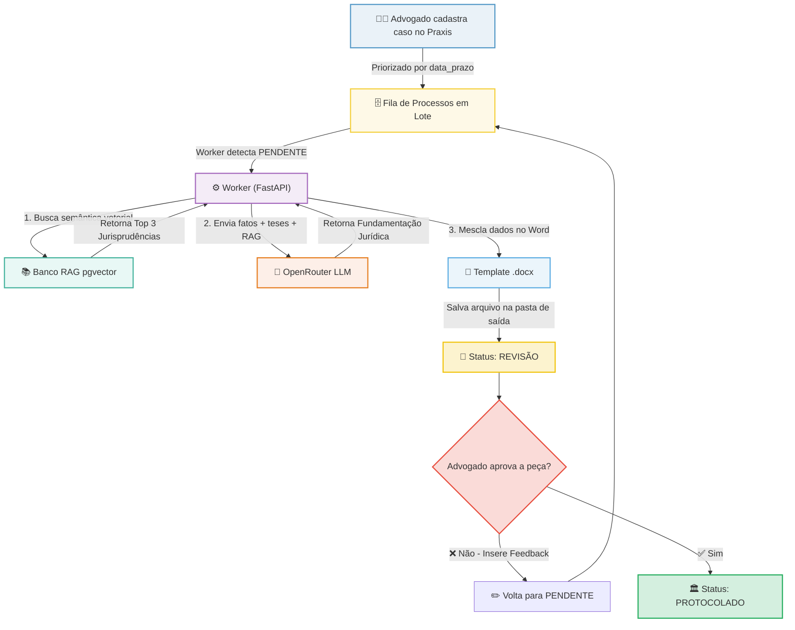

# ⚖️ Praxis — Automação Jurídica

Plataforma inteligente de automação de defesas e peças jurídicas utilizando Inteligência Artificial, busca vetorial baseada em **RAG (Retrieval-Augmented Generation)** e **PostgreSQL com pgvector**.

O **Praxis** foi projetado para otimizar o fluxo de trabalho de escritórios de advocacia, organizando processos por urgência de prazos, gerando minutas de alta fidelidade técnica em formato Word (`.docx`) a partir de modelos pré-definidos e inserindo jurisprudências relevantes de forma automatizada.

---

## 🛠️ Tecnologias e Linguagens Utilizadas

O sistema é construído sobre uma arquitetura moderna e dividida em camadas:

| Componente | Tecnologias Utilizadas | Propósito |
| :--- | :--- | :--- |
| **Frontend** | React, Vite, JavaScript, TailwindCSS | Interface do usuário rápida, responsiva e com gráficos em tempo real |
| **Backend** | Python, FastAPI, Uvicorn, Streamlit | API de alto desempenho, workers assíncronos e scripts de automação |
| **Banco de Dados** | PostgreSQL + `pgvector` | Armazenamento de dados relacionais e busca semântica vetorial (1536 dimensões) |
| **Autenticação** | JWT (JSON Web Tokens) + Argon2id | Autenticação segura de usuários com controle de permissões por cargo |
| **IA / LLM** | OpenRouter (GPT-4o, text-embedding-ada-002) | Geração do texto das peças jurídicas e criação de vetores de embeddings |
| **Documentação** | Python `python-docx` | Geração final de minutas editáveis no padrão Microsoft Word |

---

## 🏗️ Fluxo Resumido da Operação

O ecossistema opera unindo a automação assíncrona baseada em IA e a supervisão humana (*Human-in-the-Loop*). Abaixo está o fluxo simplificado do processamento de uma peça jurídica:



---

## 📂 Estrutura do Repositório

```plaintext
├── .agents/                 # Configurações de IA e assistentes
├── backend/                 # API FastAPI, Banco de Dados, scripts Python
│   ├── alimentar_jurisprudencia.py  # Script para vetorização de julgados
│   ├── auth_security.py             # Lógica de login, hashes e JWT
│   ├── banco_dados.py               # Queries SQL e conexões com o PostgreSQL
│   ├── gerador_pecas.py             # Integração com a LLM e preenchimento de DOCX
│   └── main.py                      # Arquivo principal da API FastAPI
├── frontend/                # Interface web em React
│   ├── src/                         # Componentes, rotas e views da aplicação
│   ├── vite.config.js               # Configuração do bundler Vite
│   └── package.json                 # Dependências Node.js
├── FLUXOS.md                # Documentação técnica e diagramas UML detalhados
├── docker-compose.yml       # Orquestrador local para subir o PostgreSQL + pgvector
└── README.md                # Esta visualização geral do projeto
```

---

## 🚀 Como Executar o Projeto Localmente

### 1. Pré-requisitos
* **Python 3.10+** instalado
* **Node.js (LTS)** instalado
* **Docker e Docker Compose** instalados (para o banco de dados)

### 2. Configurando o Banco de Dados
Na raiz do projeto, suba o container do PostgreSQL equipado com a extensão `pgvector`:
```bash
docker-compose up -d
```

### 3. Executando o Backend
1. Navegue até a pasta `backend`:
   ```bash
   cd backend
   ```
2. Crie e ative um ambiente virtual (`venv`):
   ```bash
   python -m venv venv
   # No Windows:
   .\venv\Scripts\activate
   # No Linux/macOS:
   source venv/bin/activate
   ```
3. Instale as dependências:
   ```bash
   pip install -r requirements.txt
   ```
4. Configure as variáveis de ambiente no arquivo `.env` (baseado no `.env.example`).
5. Execute a API:
   ```bash
   python main.py
   ```
   A documentação interativa estará disponível em: [http://localhost:8000/docs](http://localhost:8000/docs).

### 4. Executando o Frontend
1. Abra um novo terminal e navegue até a pasta `frontend`:
   ```bash
   cd frontend
   ```
2. Instale os pacotes necessários:
   ```bash
   npm install
   ```
3. Inicie o servidor de desenvolvimento:
   ```bash
   npm run dev
   ```
   Acesse a interface pelo navegador no endereço: [http://localhost:5173](http://localhost:5173).

---

## 👥 Atores do Sistema
O sistema suporta três perfis de acesso distintos configurados via banco de dados:
* **Administrador**: Controle total, gestão de usuários, definição de pastas de saída e reprocessamento.
* **Advogado**: Criação de casos, importação de CSVs, alimentação da base de dados RAG e aprovação final das peças.
* **Revisor**: Leitura dos casos cadastrados, visualização de estatísticas e controle das jurisprudências.
