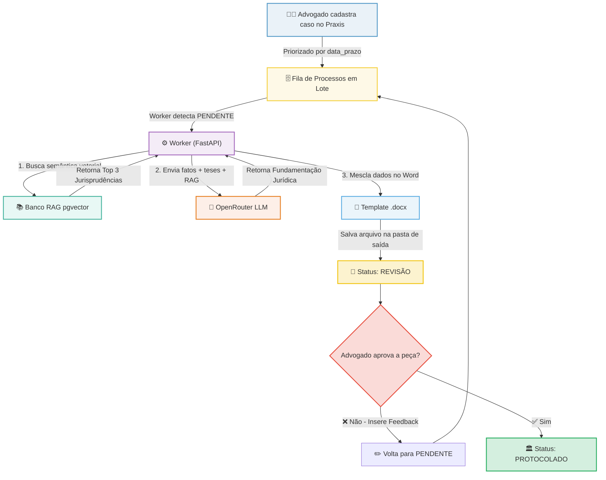
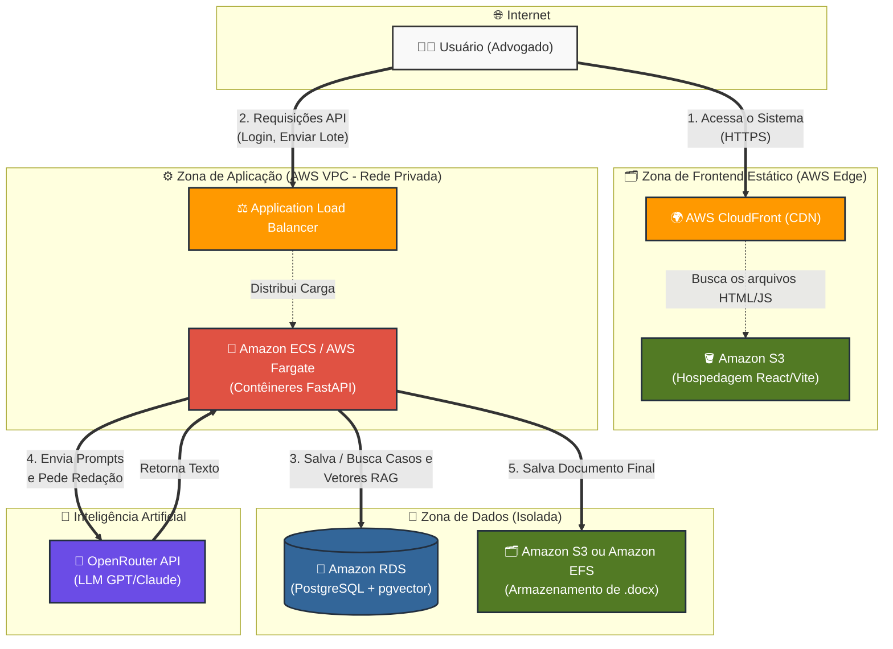

# ⚖️ Praxis — Automação Jurídica

Plataforma inteligente de automação de defesas e peças jurídicas utilizando Inteligência Artificial, busca vetorial baseada em **RAG (Retrieval-Augmented Generation)** e **PostgreSQL com pgvector**.

O **Praxis** foi projetado para otimizar o fluxo de trabalho de escritórios de advocacia, organizando processos por urgência de prazos, gerando minutas de alta fidelidade técnica em formato Word (`.docx`) a partir de modelos pré-definidos e inserindo jurisprudências relevantes de forma automatizada.

---

## 🚀 Principais Benefícios para o Escritório

A **Praxis** foi desenhada especificamente para resolver os gargalos produtivos mais comuns em escritórios de advocacia de médio e grande volume:

1. **⚡ Geração de Peças em Escala (Lote)**: Permite o upload de uma planilha CSV com dezenas de casos pendentes. A IA atua em segundo plano, gerando todas as minutas ao mesmo tempo e eliminando o processo de redigir peças semelhantes uma a uma.
2. **🎯 Fim das "Alucinações" de IA (Cofre RAG)**: Ao invés de depender de respostas genéricas do ChatGPT que podem inventar leis, a ferramenta constrói um cofre de conhecimento com as jurisprudências reais do seu escritório. A IA "lê" o caso e busca no cofre o precedente exato, garantindo segurança técnica.
3. **🛡️ Governança e Revisão Controlada**: Separação clara de papéis (Administrador, Revisor, Advogado). Os documentos gerados pela máquina não vão direto para o cliente; eles caem em uma fila de revisão onde o revisor (com sua OAB registrada e vinculada) pode editar, regerar ou aprovar o conteúdo.
4. **📄 Documentos Prontos para Uso (`.docx`)**: A aprovação gera instantaneamente um arquivo Microsoft Word (`.docx`) já no formato ideal (texto justificado, margens e cabeçalhos corretos), pronto para protocolo no PJe ou Eproc sem precisar de formatação extra.
5. **📊 Gestão Visual de Prazos**: O painel categoriza processos por urgência e status (Pendente, Erro, Revisão, Protocolado), permitindo aos gestores acompanhar o fluxo e garantir que nenhuma data crítica seja perdida.

---

## 🛠️ Tecnologias e Linguagens Utilizadas

O sistema é construído sobre uma arquitetura moderna e dividida em camadas:

| Componente | Tecnologias Utilizadas | Propósito |
| :--- | :--- | :--- |
| **Frontend (React)** | React, Vite, JavaScript, TailwindCSS | Interface original de usuário rápida e responsiva |
| **Frontend (Angular)** | Angular v20, TypeScript, Vanilla CSS | Interface moderna alternativa com Signals e excelente performance |
| **Backend** | Python, FastAPI, Uvicorn, Streamlit | API de alto desempenho, workers assíncronos e scripts de automação |
| **Banco de Dados** | PostgreSQL + `pgvector` | Armazenamento de dados relacionais e busca semântica vetorial (1536 dimensões) |
| **Autenticação** | JWT (JSON Web Tokens) + Argon2id | Autenticação segura de usuários com controle de permissões por cargo |
| **IA / LLM** | OpenRouter (GPT-4o, text-embedding-ada-002) | Geração do texto das peças jurídicas e criação de vetores de embeddings |
| **Documentação** | Python `python-docx` | Geração final de minutas editáveis no padrão Microsoft Word |

---

## 🏗️ Fluxo Resumido da Operação

O ecossistema opera unindo a automação assíncrona baseada em IA e a supervisão humana (*Human-in-the-Loop*). Abaixo está o fluxo simplificado do processamento de uma peça jurídica:



---

## 📂 Estrutura do Repositório

```plaintext
├── .agents/                 # Configurações de IA e assistentes
├── backend/                 # API FastAPI, Banco de Dados, scripts Python
│   ├── alimentar_jurisprudencia.py  # Script para vetorização de julgados
│   ├── auth_security.py             # Lógica de login, hashes e JWT
│   ├── banco_dados.py               # Queries SQL e conexões com o PostgreSQL
│   ├── gerador_pecas.py             # Integração com a LLM e preenchimento de DOCX
│   └── main.py                      # Arquivo principal da API FastAPI
├── frontend/                # Interface web original em React
│   ├── src/                         # Componentes, rotas e views da aplicação
│   ├── vite.config.js               # Configuração do bundler Vite
│   └── package.json                 # Dependências Node.js
├── frontend-angular/        # Interface web alternativa em Angular v20
│   ├── src/                         # Componentes e serviços da aplicação
│   ├── tsconfig.json                # Configuração do compilador TypeScript
│   └── package.json                 # Dependências Node.js e Angular
├── FLUXOS.md                # Documentação técnica e diagramas UML detalhados
├── docker-compose.yml       # Orquestrador local para subir o PostgreSQL + pgvector
└── README.md                # Esta visualização geral do projeto
```

---

## 🔄 Atualização e Controle de Versão (Git)

O repositório está configurado para utilizar branches de desenvolvimento específicas.

### Rastreamento de Branch e Atualizações (`git pull`)
A branch de desenvolvimento ativa para as otimizações do Docker é a `feature/otimizar-docker`. Ela está configurada para rastrear diretamente o repositório no GitHub (`origin/feature/otimizar-docker`).

* **Para atualizar a branch local:**
  Como a branch local já rastreia a branch remota do GitHub, basta executar o comando simples na raiz do projeto:
  ```bash
  git pull
  ```
  O Git buscará as atualizações da branch `origin/feature/otimizar-docker` e fará a mesclagem automática.
  
* **Para fazer o pull de forma explícita:**
  ```bash
  git pull origin feature/otimizar-docker
  ```

---

## 🚀 Como Executar o Projeto (Produção e Desenvolvimento com Docker)

O ambiente foi totalmente otimizado para rodar via Docker, garantindo que o Backend e o Frontend funcionem com imagens leves e seguras em qualquer sistema operacional ou servidor.

### 1. Pré-requisitos
* **Docker e Docker Compose** instalados.

### 2. Configurando as Variáveis de Ambiente
Na **raiz do projeto** (na mesma pasta do `docker-compose.yml`), crie um arquivo chamado `.env` e configure as seguintes variáveis:

```ini
# Chaves de API das Inteligências Artificiais
GEMINI_API_KEY=sua-chave-aqui
OPENROUTER_API_KEY=sua-chave-aqui

# Conexão com o seu banco Postgres existente
DB_HOST=192.168.1.107  # Coloque o IP do seu servidor de banco de dados
DB_PORT=5432
DB_NAME=seu_banco
DB_USER=seu_usuario
DB_PASS=sua_senha

# Chaves de Segurança da Autenticação (JWT e Senhas)
JWT_SECRET=coloque-uma-senha-gigante-e-secreta-aqui
PASSWORD_PEPPER=outra-senha-gigante-aleatoria-diferente-da-primeira
```

### 3. Construindo e Executando os Containers
Execute a sequência de comandos abaixo. A flag `--no-cache` garante que o Docker leia as dependências e chaves mais recentes:

```bash
sudo docker compose down
sudo docker compose build --no-cache
sudo docker compose up -d
```

### 3.1. Iniciando Serviços Separadamente (Docker Compose)
Caso queira iniciar apenas um dos serviços configurados no Compose:

* **Iniciar apenas o Backend**:
  ```bash
  docker compose up -d backend
  ```

* **Iniciar apenas o Frontend React (sem as dependências)**:
  Como o frontend depende do backend, por padrão o Compose iniciará ambos. Para forçar a inicialização **apenas** do frontend, utilize a flag `--no-deps`:
  ```bash
  docker compose up -d --no-deps frontend
  ```

* **Iniciar apenas o Frontend Angular (sem as dependências)**:
  ```bash
  docker compose up -d --no-deps frontend-angular
  ```

### 3.2. Detalhes de Funcionamento e Portas dos Frontends no Docker

O repositório possui duas interfaces de frontend que rodam em containers Nginx alpinos de forma independente:

#### A. Frontend React (Vite)
* **Serviço no Compose**: `frontend`
* **Porta Exposta**: `5173` (mapeada para a porta interna `80` do Nginx)
* **Funcionamento e API**:
  * Ao ser empacotada no Docker, a aplicação React é compilada em arquivos estáticos (HTML/JS/CSS) e servida pelo Nginx.
  * A comunicação com a API do backend ocorre diretamente a partir do navegador do usuário.
  * Por padrão, a URL da API é resolvida dinamicamente no navegador para `http://<IP_DO_VISITANTE>:8000`. Caso o seu backend esteja em outra porta (como a porta `8087` exposta pelo compose), você pode passar a variável de ambiente `VITE_API_URL` ao compilar:
    ```bash
    docker build --build-arg VITE_API_URL=http://<IP_DO_BACKEND>:8087 -t praxis-frontend ./frontend
    ```
* **Recompilar/Atualizar após alterações locais:**
  ```bash
  docker compose down
  docker compose build --no-cache frontend
  docker compose up -d frontend
  ```

#### B. Frontend Angular (v20)
* **Serviço no Compose**: `frontend-angular`
* **Porta Exposta**: `4200` (mapeada para a porta interna `80` do Nginx)
* **Funcionamento e API**:
  * Os arquivos compilados do Angular são servidos por um servidor Nginx interno com suporte a roteamento SPA (Single Page Application).
  * A URL da API é definida no arquivo `config.ts`. Se acessado via `localhost`, ele tentará se comunicar com o backend no IP fixo `http://192.168.1.107:8087` ou na porta `8087` sob o mesmo hostname detectado (`http://${window.location.hostname}:8087`).
* **Recompilar/Atualizar após alterações locais:**
  ```bash
  docker compose down
  docker compose build --no-cache frontend-angular
  docker compose up -d frontend-angular
  ```

### 4. Acessando a Plataforma
Após os containers subirem com sucesso:
* **Interface Web React (Frontend):** Acesse `http://IP_DA_VM:5173` (ou `localhost:5173`).
* **Interface Web Angular (Frontend):** Acesse `http://IP_DA_VM:4200` (ou `localhost:4200`).
* **API e Swagger (Backend):** Acesse `http://IP_DA_VM:8087/docs` (ou `localhost:8087/docs`).

> **📁 Arquivos Gerados:** Os documentos `.docx` das peças jurídicas e revisões serão salvos automaticamente e espelhados na pasta `./documentos_gerados` na raiz do seu projeto, graças ao volume compartilhado do Docker!

### 5. Construindo e Executando Imagens Separadamente

Caso necessite compilar as imagens individualmente ou precise levantar um banco de dados PostgreSQL local com suporte a busca vetorial (pgvector):

#### A. Compilar apenas o Backend
```bash
docker build -t praxis-backend ./backend
```

#### B. Compilar apenas o Frontend React
```bash
docker build -t praxis-frontend ./frontend
```

#### C. Compilar apenas o Frontend Angular
```bash
docker build -t praxis-frontend-angular ./frontend-angular
```

#### C. Executar Banco de Dados (PostgreSQL + pgvector) em container separado
Como o `docker-compose.yml` padrão conecta a um banco externo/host, você pode subir um banco PostgreSQL isolado com suporte ao `pgvector` usando:
```bash
docker run -d \
  --name praxis_postgres \
  -p 5432:5432 \
  -e POSTGRES_DB=postgres \
  -e POSTGRES_USER=postgres \
  -e POSTGRES_PASSWORD=senha \
  ankane/pgvector:latest
```

### 6. Parando Containers Individualmente

Caso precise parar ou reiniciar apenas um dos serviços ou containers:

#### A. Usando Docker Compose (Multi-container)
Para parar ou iniciar um serviço específico gerenciado pelo Compose:
* **Parar apenas o Backend**:
  ```bash
  docker compose stop backend
  ```
* **Parar apenas o Frontend**:
  ```bash
  docker compose stop frontend
  ```
* **Iniciar apenas o serviço que está parado**:
  ```bash
  docker compose start <servico>
  ```

#### B. Usando Containers Isolados (Docker Run)
Se você executou os containers de forma independente:
* **Parar o Backend**:
  ```bash
  docker stop praxis_backend
  ```
* **Parar o Frontend**:
  ```bash
  docker stop praxis_frontend
  ```
* **Parar o Banco de Dados (pgvector)**:
  ```bash
  docker stop praxis_postgres
  ```

---

## 👥 Atores do Sistema
O sistema suporta três perfis de acesso distintos configurados via banco de dados:
* **Administrador**: Controle total, gestão de usuários, definição de pastas de saída e reprocessamento.
* **Advogado**: Criação de casos, importação de CSVs, alimentação da base de dados RAG e aprovação final das peças.
* **Revisor**: Leitura dos casos cadastrados, visualização de estatísticas e controle das jurisprudências.

---

## ☁️ Arquitetura AWS (Cloud-Native) Recomendada

Para escritórios que desejam sair do ambiente local/VM e escalar a operação de forma segura na nuvem da Amazon Web Services (AWS), a arquitetura abaixo demonstra como a plataforma se comporta em um ambiente de alto nível de disponibilidade e segurança:



### Componentes da Arquitetura:
1. **Frontend Serverless**: O React (Vite) é hospedado de forma estática e barata no **Amazon S3** e distribuído globalmente com baixíssima latência via **AWS CloudFront**.
2. **Backend Escalável**: O FastAPI roda como contêineres Docker no **Amazon ECS com AWS Fargate**, permitindo que o sistema aumente a capacidade automaticamente se houver um pico de 500 processos enviados simultaneamente.
3. **Banco de Dados Gerenciado**: O **Amazon RDS** suporta a extensão `pgvector` nativamente, garantindo backups automáticos e segurança para os dados sigilosos e embeddings das jurisprudências.
4. **Armazenamento de Peças**: Em vez do disco local da máquina, os documentos `.docx` podem ser salvos e baixados diretamente pelo **Amazon EFS** (disco de rede) ou **Amazon S3**, impedindo perda de arquivos em caso de reinicialização dos servidores.

### 📈 Escalonamento Horizontal (Para Altíssimos Volumes)
A arquitetura do Praxis é **stateless**, o que significa que foi desenhada para escalar horizontalmente de forma automática:
* **Frontend**: O S3 e o CloudFront escalam infinitamente de forma nativa.
* **Banco de Dados (Leitura Vetorial)**: O RDS permite habilitar *Read Replicas* (Clones de Leitura) caso milhares de advogados pesquisem no RAG simultaneamente.
* **Processamento de Peças em Lote (Worker + SQS)**: Para gerar planilhas gigantes de **5.000 ou mais processos**, o Load Balancer (ALB) da AWS cria novos contêineres iguais ao backend automaticamente quando a CPU atinge 70% de uso. Para maximizar essa performance, recomenda-se integrar o **Amazon SQS (Simple Queue Service)**. O backend joga os processos na fila e um "exército" de contêineres puxa os casos do SQS, gerando centenas de minutas em paralelo e com total segurança anti-falha.
